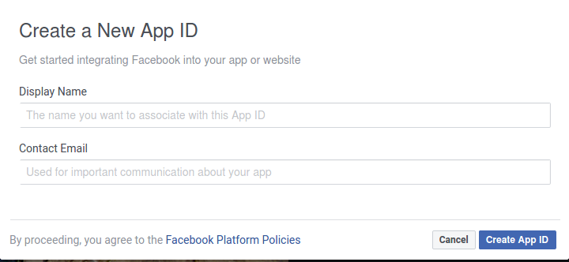
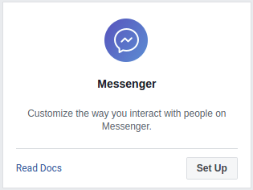

# Alfred the HR Butler

## Get Started

### Env Setup
* Make Sure You have Node and Npm Installed.
    * ``` sudo apt-get update ```
    * ``` sudo apt-get install nodejs ```
    * ``` sudo apt-get install npm ```


* Check if installation was successful 
    * ``` nodejs -v ```
    * This should log your installed Node js Version.

### WebHook Setup

Fork the Repo to Your Git and clone to your device to Get Started!

* Go to [Facebook  Developers](https://developers.facebook.com/ "Facebook for Developers") and under MY Apps select Create App.

* Fill in The App name and Select Messenger.







* Create a new Facebook Page and Add that Page to your new App.

* You app will provide you with an access Key.

* Now Open up Heroku and Create new app.

* Go to Settings and Select Reveal Config Vars and put your **PAGE_ACCES_TOKEN** here, along with **VERIFY_TOKEN** which can be any random String of your choice.

* Now go to Deploy and GitHub. If your account is not already connected connect your account and deploy your forked repo. 
  **NOTE : Make sure to specify the branch which you would like to deploy.** 

* After You are Done deploying click on View app and you will be taken to the URL of your app.

* Copy the URL example - **https://myNewApp.herokuapp.com/** 

* Go to Your App that you opened on Facebook Developers and go to settings. Click on Add Callback Url and enter the details as shown below.

* Your webhook setup is now complete!!

### Page and App Setup

* Go to your App and subscribe to these following features.

* Go to your facebook Page and go to settings
    * Go to Advanced Messaging .
    * Select configure from App Settings .
    * Set Primary receiver for handover protocol to your Page.
    * Set Secondary receiver for handover protocol to Page inbox.
